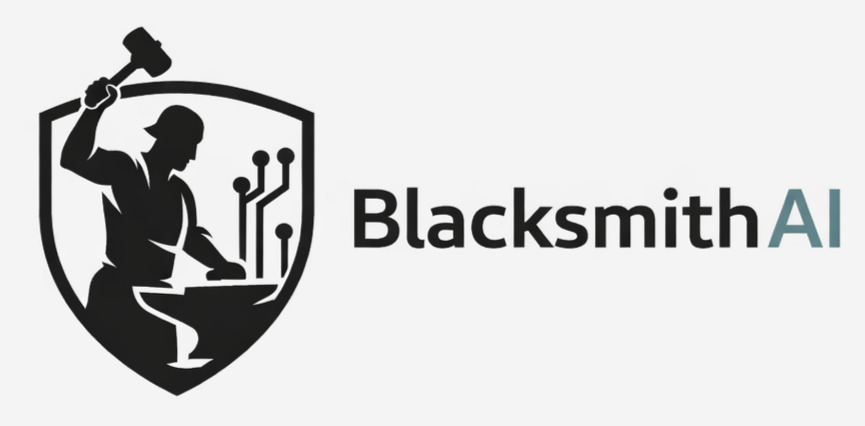
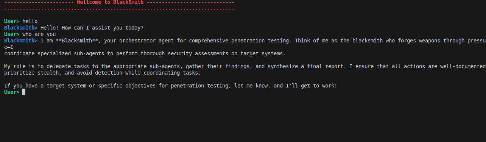

<div align="center">



# BlacksmithAI

**[OPEN-SOURCE] AI-Powered Penetration Testing Framework**

An intelligent multi-agent system for automated security assessment and penetration testing.

[Documentation](#documentation) • [Quick Start](#quick-start) • [Architecture](#architecture) • [Tools](#tools)

</div>

---

## Table of Contents

- [Overview](#overview)
- [Architecture](#architecture)
- [Prerequisites](#prerequisites)
- [Installation](#installation)
- [Quick Start with Makefile](#quick-start-with-makefile)
- [Configuration](#configuration)
- [Usage](#usage)
- [Tools & Capabilities](#tools--capabilities)
- [Agent Workflow](#agent-workflow)
- [Troubleshooting](#troubleshooting)
- [Documentation](#documentation)

---

## Overview

BlacksmithAI is an **opensource** advanced penetration testing framework that leverages multiple AI agents to automate security assessments. The system orchestrates specialized agents through a complete penetration testing lifecycle—from reconnaissance to post-exploitation—using professional security tools in a controlled environment.

### Key Features

- **Multi-Agent Architecture**: Specialized agents for each phase of penetration testing
- **Professional Tooling**: Pre-configured Docker image with industry-standard security tools
- **Flexible LLM Providers**: Support for OpenRouter, VLLM, and custom providers
- **Web & Terminal Interfaces**: Choose between a modern UI or CLI interaction
- **Automated Reporting**: Generates comprehensive security reports with evidence
- **Safe & Controlled**: Non-interactive CLI tools designed for AI agent execution

### Use Cases

- Automated security assessments
- Continuous security monitoring
- Educational penetration testing
- Vulnerability discovery and validation
- Security research and development

---

## Architecture

BlacksmithAI uses a hierarchical multi-agent system.

### Agent Hierarchy

1. **Orchestrator**
   - Command and control center
   - Manages mission planning and task delegation
   - Coordinates subagents and generates final reports

2. **Specialized Subagents**
   - **Recon Agent**: Attack surface mapping and information gathering
   - **Scan/Enum Agent**: Deep scanning and service enumeration
   - **Vulnerability Analysis Agent**: Vulnerability mapping and risk assessment
   - **Exploit Agent**: Proof-of-concept exploitation
   - **Post-Exploit Agent**: Impact assessment and pivot analysis

Each agent has access to specific tools tailored to its role, ensuring efficient and focused operations.

---

## Prerequisites

### System Requirements

- **Operating System**: Linux (recommended), macOS, or Windows with WSL2
- **RAM**: Minimum 4GB (8GB recommended)
- **Disk Space**: 2GB+ including Docker images
- **Docker**: 20.10+ with Docker Compose
- **Python**: 3.12+ (managed via uv)

---

## Software Dependencies

We rely on the following tools:

```bash
# Python package & environment manager
uv

# Containerization
Docker & Docker Compose

# Frontend runtime & tooling
Node.js 18+ (LTS recommended)
pnpm (fast JavaScript package manager)
```

---

## 1. Python: `uv`

`uv` is a fast, modern Python package manager + environment tool — kind of like a turbocharged combo of `pip`, `pipx`, and `virtualenv`. ([GitHub][1])

### Install `uv`

#### macOS & Ubuntu / Linux

```bash
# Install via official install script
curl -LsSf https://astral.sh/uv/install.sh | sh
```

If you prefer a Python-packaged version:

```bash
pip install uv
# or
pipx install uv
```

Verify:

```bash
uv --version
```

Notes:

* Standalone script is recommended for full functionality and auto-updates. ([Astral Docs][2])
* On Windows use PowerShell:

```powershell
powershell -ExecutionPolicy ByPass -c "irm https://astral.sh/uv/install.ps1 | iex"
```

---

## 2. Docker & Docker Compose

Docker lets us containerize and run backend services, databases, etc.

### Install on Ubuntu / Debian

```bash
sudo apt update
sudo apt install -y docker.io docker-compose
```

### macOS

```bash
brew install --cask docker
```

After installing, start Docker Desktop and confirm:

```bash
docker --version
docker compose version
```

If you see version outputs, you’re good to go.

**Tip:** On Linux you may want to add your user to the `docker` group:

```bash
sudo usermod -aG docker $USER
# Then restart your terminal
```

---

## 3. Node.js 18+

We use Node.js for frontend tooling. Node 18+ is required for modern `pnpm` and ecosystem compatibility. ([docs.pyloid.com][3])

### Ubuntu / Debian

```bash
# Using NodeSource setup (recommended for precise versions)
curl -fsSL https://deb.nodesource.com/setup_18.x | sudo -E bash -
sudo apt install -y nodejs
```

### macOS

Install with Homebrew:

```bash
brew install node@18
```

Verify:

```bash
node --version
npm --version
```

---

## 4. pnpm (Fast JavaScript Package Manager)

`pnpm` is preferred for consistent, fast installs and predictable lockfiles. ([pnpm.cn][4])

### Install pnpm

You can install via one of these:

#### From npm

```bash
npm install -g pnpm
```

#### Using standalone script (npm not required)

```bash
curl -fsSL https://get.pnpm.io/install.sh | sh -
```

#### With Corepack (Node.js bundled tool manager)

```bash
corepack enable
corepack prepare pnpm@latest --activate
```

Verify:

```bash
pnpm --version
```

---

## Verify Your Dev Environment

Try these checks:

```bash
uv --version
node --version
pnpm --version
docker --version
docker compose version
```

## vLLM setup

if you want to use vLLM local models

### setup vLLM
```
cd blacksmithAI/blacksmithAI
uv add vllm --torch-backend=auto
uv add huggingface_hub

# if you don't have huggingface cli
pip install huggingface-cli

# login to hugging face if required
huggingface-cli login
```

### Serve

```bash
vllm serve mistralai/Devstral-2-123B-Instruct-2512 \
  --host 0.0.0.0 \
  --port 8000 \
  --max-model-len 8192 \
  --gpu-memory-utilization 0.75
```
---

## Installation

### Step 1: Clone the Repository

```bash
git clone <repository-url>
cd blacksmithAI/blacksmithAI
```

### Step 2: Install Python Dependencies

```bash
# Install dependencies using uv
uv sync
```

### Step 3: Build the mini-kali Docker Image

The mini-kali container provides all penetration testing tools in a secure, isolated environment.

```bash
# start it with
cd blacksmithAI/blacksmithAI
docker compose up -d
```

### Step 4: Install Frontend Dependencies (Optional)

Skip this if using the terminal-only interface.

```bash
cd blacksmithAI/frontend
pnpm install
cd ../..
```

---

## Quick Start with Makefile

For a simpler setup experience, use the provided Makefile commands. Run `make help` to see all available commands.

### Complete Setup (One-Command)

```bash
make setup
```

This command performs:
- Python dependency installation (`make install`)
- Docker image building (`make docker-build`)
- Frontend dependency installation (`make frontend-install`)

### Initial Configuration

After running `make setup`, configure your environment:

```bash
# 1. Copy example environment file
cp blacksmithAI/.env.example blacksmithAI/.env

# 2. Edit .env with your API keys
nano blacksmithAI/.env

# 3. Edit config.json for your LLM provider
nano blacksmithAI/config.json

# 4. Embed tool documentation
make embed-tools
```

### Running BlacksmithAI

#### CLI Mode

```bash
make start-cli
```

This command:
- Starts the mini-kali Docker container
- Launches the CLI interface

#### Web UI Mode

The Web UI requires multiple terminals. Run these commands in separate terminals:

```bash
# Terminal 1: Start Docker container
make docker-up

# Terminal 2: Start frontend
cd frontend && pnpm build && pnpm start

# Terminal 3: Start LangGraph dev server
cd blacksmithAI && langgraph dev
```

Then access: **http://localhost:3000**

### Using VLLM (Local LLM)

```bash
# Install VLLM
make vllm-install

# Start VLLM server
make vllm-serve
# Or for smaller systems:
make vllm-serve-small
```

### Available Makefile Commands

| Command | Description |
|---------|-------------|
| `make help` | Show all available commands |
| `make install` | Install Python dependencies |
| `make setup` | Complete initial setup |
| `make frontend-install` | Install frontend dependencies |
| `make docker-build` | Build mini-kali Docker image |
| `make docker-up` | Start Docker container |
| `make docker-down` | Stop Docker container |
| `make docker-logs` | View Docker logs |
| `make embed-tools` | Embed tool documentation |
| `make vllm-install` | Install VLLM for local LLM |
| `make vllm-serve` | Start VLLM server (123B model) |
| `make vllm-serve-small` | Start VLLM server (7B model) |
| `make start-cli` | Start CLI mode |
| `make start-ui` | Show Web UI setup instructions |
| `make start-all` | Quick start CLI mode |
| `make stop` | Stop all services |
| `make clean` | Clean up Docker containers |
| `make status` | Show Docker container status |
| `make check-deps` | Check if dependencies are installed |
| `make check-config` | Check configuration files |
| `make quickstart` | Display quick start guide |

### Quick Reference

```bash
# First time setup
make setup
cp blacksmithAI/.env.example blacksmithAI/.env
# Edit .env with your API keys
make embed-tools

# Start CLI
make start-cli

# Start Web UI (3 terminals)
make docker-up
cd frontend && pnpm build && pnpm start
cd blacksmithAI && langgraph dev

# Stop everything
make stop
```

---

## Configuration

### Environment Variables

Create a `.env` file from the example:

```bash
cp blacksmithAI/.env.example blacksmithAI/.env
```

#### Using OpenRouter (Cloud LLM Provider)

Edit `.env` and add your API key:

```bash
OPENROUTER_API_KEY=your-openrouter-api-key-here
```

#### Using VLLM (Local LLM Provider)

No environment variables needed. Ensure your VLLM server is running:

```bash
# Example VLLM server startup
vllm serve <model-name> --port 8000
```

### Application Configuration

Edit `blacksmithAI/config.json` to configure LLM providers and models.

```json
{
  "defaults": {
    "provider": "openrouter",  // or "vllm", or custom
  },
  "providers": {
    "openrouter": {
      "base_url": "https://openrouter.ai/api/v1/chat/completions",
      "default_model": "mistralai/devstral-2512:free",
      "default_embedding_model": "openai/text-embedding-3-small",
      "default_model_config": {
        "context_size": 200000,
        "max_retries": 3,
        "stream_usage": true,
        "max_tokens": null
      },
      "default_embedding_model_config": {
        "max_retries": 3,
        "embedding_ctx_length": 8191
      }
    },
    "vllm": {
      "base_url": "http://localhost:8000/v1/chat/completions",
      "default_model": "mistralai/devstral-2512",
      "default_embedding_model": "text-embedding-3-small",
      "default_model_config": {
        "context_size": 200000,
        "max_retries": 3,
        "stream_usage": true,
        "max_tokens": null
      },
      "default_embedding_model_config": {
        "max_retries": 3,
        "embedding_ctx_length": 8191
      }
    }
  }
}
```

**you can support for more providers like openai, claude,...and many more. by simply editing config.json and adding api key to .env**
```
for example if you want to add support for openai you can add this to providers in config.json:

   "openai": {
      "base_url": "....",
      "default_model": "gpt-5-mini",
      "default_embedding_model": "text-embedding-3-small",
      "default_model_config": {
        "context_size": 200000,
        "max_retries": 3,
        "stream_usage": true,
        "max_tokens": null
      },
      "default_embedding_model_config": {
        "max_retries": 3,
        "embedding_ctx_length": 8191
      }
    }

since the name of the provider here is set to `openai` you need to add OPENAI_API_KEY=**** to env file. so uppercase(provider_name)+API_KEY to env.
set the new provider to default by modifying: 

	  "defaults": {
	    "provider": "openai"
	  },

Now everything is configured for openai.

```

**you can easily scaleup with the above method and add more support.**

#### Configuration Options

- **`defaults.provider`**: Default LLM provider to use
- **`base_url`**: API endpoint for the provider
- **`default_model`**: LLM model identifier
- **`default_embedding_model`**: Model for embeddings (used in vector DB)
- **`context_size`**: Context window size of the selected model(required for summerization, to prevent context window overflow)
- **`max_retries`**: Number of retry attempts for failed requests
- **`max_tokens`**: Maximum tokens in responses (null = model default)

---

### embed documentatation

You need to embed tool documentation for the AI agents to use as reference

```bash
uv run blacksmithAI/blacksmithAI/update_tool_documentation.py
```

## Usage

### Option 1: Terminal Interface (CLI)

Interact directly through the terminal with full agent control.



```bash
# Start mini-kali Docker container
docker run -i --rm -p 9756:9756 mini-kali-slim -d

or 

cd blacksmithAI/blacksmithAI
docker compose up -d

# Run BlacksmithAI
cd blacksmithAI/blacksmithAI && uv run main.py

or 

cd blacksmithAI && make start-cli
```

Follow the prompts to initiate penetration testing tasks.

### Option 2: Web UI

Access a modern, user-friendly interface for managing penetration tests.

```bash
# Terminal 1: Start mini-kali container
docker run -i --rm -p 9756:9756 mini-kali-slim -d

or 

cd blacksmithAI/blacksmithAI
docker compose up -d


# Terminal 2: Start the frontend
cd blacksmithAI/frontend
pnpm build
pnpm start

# Terminal 3: Start LangGraph development server
cd blacksmithAI/blacksmithAI
langgraph dev
```

Access the UI at: **http://localhost:3000**

### Option 3: Cloud Version

A hosted version is available for quick testing without local setup.

```
URL: [coming soon]
```

---

## Tools & Capabilities

BlacksmithAI provides access to professional penetration testing tools through the mini-kali Docker container. All tools are designed for non-interactive, stdin/stdout execution—ideal for AI agents.

### Reconnaissance Tools

Build the attack surface map through passive and active information gathering.

| Tool | Purpose |
|------|---------|
| `assetfinder` | Discover subdomains and assets |
| `subfinder` | Subdomain enumeration |
| `whois` | Domain registration information |
| `dig` | DNS record lookup |
| `nslookup` | DNS query tool |
| `hping3` | Network scanning and packet analysis |
| `dnsrecon` | DNS enumeration and reconnaissance |

### Scanning & Enumeration

Deep dive into discovered targets to identify services and vulnerabilities.

| Tool | Purpose |
|------|---------|
| `nmap` | Network mapper and port scanner |
| `masscan` | High-speed port scanner |
| `enum4linux-ng` | SMB/Windows enumeration |
| `nikto` | Web server scanner |
| `whatweb` | Web technology identification |
| `fingerprintx` | Service fingerprinting |
| `gobuster` | Directory and DNS brute-forcing |
| `wpscan` | WordPress vulnerability scanner |

### Vulnerability Analysis

Map services to known vulnerabilities and assess security risks.

| Tool | Purpose |
|------|---------|
| `nuclei` | Fast and customizable vulnerability scanner |
| `sslscan` | SSL/TLS configuration analyzer |

### Exploitation Tools

Execute controlled exploits and validate vulnerabilities.

| Tool | Purpose |
|------|---------|
| `sqlmap` | Automated SQL injection |
| `hydra` | Password brute-forcing |
| `medusa` | Parallel network login auditor |
| `ncrack` | Network authentication cracking |
| `python/go/perl/ruby` | Custom exploit scripting |

### Post-Exploitation

Assess impact and identify pivot opportunities after successful exploitation.

| Tool | Purpose |
|------|---------|
| `netcat` | Network debugging and data transfer |
| `socat` | Multi-purpose relay |
| `ssh -D` | SOCKS proxy tunneling |
| `impacket` | Windows protocol manipulation (psexec, secretsdump) |

### General Utilities

Support tools for various tasks.

| Tool | Purpose |
|------|---------|
| `curl` | Data transfer with URL syntax |
| `httpie` | User-friendly HTTP client |
| `trufflehog` | Secret and credential scanner |

### Upcoming Features

- **Web Browser**: MCP-Playwright for automated web browsing
- **Code Interpreter**: MCP code interpreter for Python execution
- **Exploits Database**: Integration with Exploit-DB, or other providers for exploit scripts
- **Interactive Tools**: Support for Metasploit and other interactive frameworks

---

## Agent Workflow

BlacksmithAI follows a structured penetration testing methodology through coordinated agent execution.

### 1. Orchestrator Agent

**Role**: General Commander

The orchestrator is the central coordination point that:
- Maintains the high-level mission plan
- Manages a todo list of tasks
- Delegates work to specialized subagents
- Generates structured final reports with findings, severity, evidence, and remediation guidance

**Available Tools**: planning tools, filesystem tools

### 2. Reconnaissance Agent

**Role**: Attack Surface Mapping

Builds a comprehensive map of the target environment:
- **Passive OSINT**: DNS records, SSL certificates, WHOIS data
- **Active Network Scanning**: Port and service discovery
- **Tech Stack Fingerprinting**: Identify technologies and versions

**Available Tools**: Reconnaissance tools, general utilities

### 3. Scanning & Enumeration Agent

**Role**: Deep Inspection

After attack surface mapping, this agent:
- Performs user enumeration
- Probes APIs and endpoints
- Discovers versions and misconfigurations
- Identifies potential entry points

**Available Tools**: Scanning & enumeration tools, general utilities

### 4. Vulnerability Analysis Agent

**Role**: Risk Assessment

Analyzes outputs from scanning to:
- Map services to known vulnerabilities (CVEs, logic flaws)
- Prioritize by impact, exploitability, and business risk
- Generate concise evidence summaries
- Create attack hypotheses

**Available Tools**: Vulnerability mapping tools, general utilities

### 5. Exploitation Agent

**Role**: Proof-of-Concept Execution

Validates vulnerabilities through controlled exploitation:
- Execute exploits in a controlled manner
- Validate impact without collateral damage
- Provide clean proof of compromise
- Return evidence (e.g., shell access, data extraction)

**Available Tools**: Exploitation tools, general utilities

### 6. Post-Exploitation Agent

**Role**: Impact Assessment

After successful exploitation:
- Assess the blast radius of the compromise
- Identify pivot paths for lateral movement
- Discover credentials and authentication mechanisms
- Document business impact

**Available Tools**: Post-exploitation tools, general utilities

### Workflow Visualization

```
Orchestrator
    ↓
Recon Agent → Attack Surface Map
    ↓
Scan/Enum Agent → Detailed Service Information
    ↓
Vuln Analysis Agent → Vulnerability Prioritization
    ↓
Exploit Agent → Proof of Concept
    ↓
Post-Exploit Agent → Impact Assessment
    ↓
Orchestrator → Final Report
```

---

## Troubleshooting

### Docker Issues

**Container won't start**
```bash
# Check Docker is running
docker ps

# View container logs
docker logs mini-kali-slim
```

**Port conflicts**
```bash
# Check what's using port 9756
lsof -i :9756

# Use a different port
docker run -i --rm -p 9757:9756 mini-kali-slim -d
```

### LLM Provider Issues

**OpenRouter connection errors**
- Verify API key in `.env` file
- Check OpenRouter status: https://status.openrouter.ai/
- Ensure internet connectivity

**VLLM connection errors**
- Verify VLLM server is running: `curl http://localhost:8000/v1/models`
- Check port configuration in `config.json`
- Ensure sufficient GPU/memory for VLLM

### Frontend Issues

**Build errors**
```bash
# Clean and rebuild
cd blacksmithAI/frontend
rm -rf node_modules .next
pnpm install
pnpm build
```

**UI not connecting**
- Ensure LangGraph dev server is running
- Check browser console for errors
- Verify port 3000 is not in use

### Agent Performance

**Slow responses**
- Switch to faster LLM model
- Check system resources (RAM/CPU)

**Agent stuck in loop**
- Reduce task complexity
- Check tool documentation
- Review agent logs for errors

### Common Errors

**"Module not found"**
```bash
# Reinstall dependencies
cd blacksmithAI/blacksmithAI
uv sync
```

**"Permission denied"**
```bash
# Fix file permissions
chmod +x blacksmithAI/blacksmithAI/main.py
```

---

## Documentation

For more detailed information, refer to:

- **[Tools Documentation](blacksmithAI/tools.md)**: Complete list of available tools and their capabilities
- **[Agent Tool Documentation](blacksmithAI/agents/tools_doc/)**: Tool-specific documentation for each agent

### Contributing

Contributions are welcome! Please read our contributing guidelines before submitting pull requests.

### License

This project is **open-source**:

The source code is available under the **[GPL‑3.0‑only](https://opensource.org/licenses/GPL-3.0)** open‑source license for community use, modification, and redistribution (see `LICENSE-GPL.txt`).

For commercial use under different terms (for example, closed‑source distribution or integration without copyleft obligations), please contact us to obtain a **commercial license**.

You may choose which license to comply with when you use the code.

[Contact me]📧(mailto:jochr2023@gmail.com)

### Support

- **Issues**: Report bugs and feature requests on GitHub
- **Discussions**: Join our community discussions
- **Documentation**: Check our Wiki for additional resources

---

<div align="center">

**Built with ❤️ for the security community**

</div>
